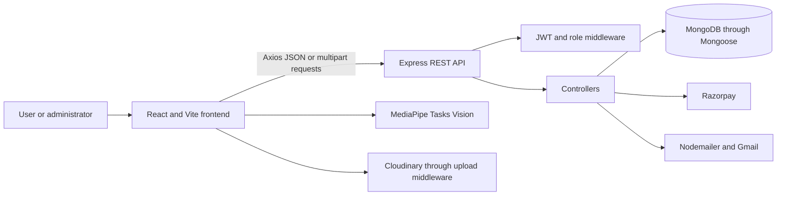
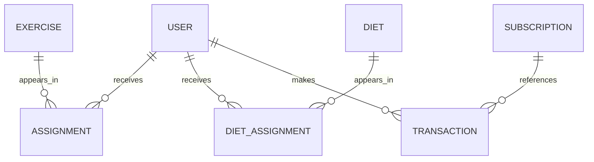

# FitTrack

FitTrack is a React and Express fitness platform for managing exercise plans, diet assignments, subscriptions, and user fitness information.

## Overview

FitTrack provides separate user and administrator workflows. Users can register, complete fitness details, view assigned exercises and diets, calculate a calorie recommendation, upload a profile image, reset a password, and purchase a subscription. Administrators can manage users, exercises, diets, subscription plans, coupons, and payment transactions.

The application also includes a browser-based exercise camera that uses MediaPipe pose landmarks to analyze movement and count repetitions.

## Features

### User Features

- Registration, login, persisted authentication state, and logout
- Profile details, fitness information, calorie recommendations, and profile image upload
- Assigned exercise and diet views
- Subscription browsing, coupon application, and Razorpay checkout
- Password reset by email

### Administrator Features

- Protected dashboard, user list, and individual user details
- Exercise creation and assignment by gender and weekday
- Diet creation and assignment by category
- Subscription plan, coupon, and transaction management

### Fitness Features

- Exercise records grouped by target gender
- Diet records with macronutrients and calories
- MediaPipe pose detection and repetition tracking through the browser camera
- Three.js fitness intro animation

## Tech Stack

| Category | Technology | Purpose |
| --- | --- | --- |
| Frontend | React 19, Vite, React Router | Single-page application, development server, and routing |
| API client | Axios | Frontend REST requests |
| Backend | Node.js, Express 5 | HTTP API and request handling |
| Database | MongoDB, Mongoose | Persistent data and schemas |
| Authentication | JWT, bcrypt | Token authentication and password hashing |
| Payments | Razorpay | Order creation and checkout |
| Email | Nodemailer with Gmail | Password-reset delivery |
| Storage | Cloudinary, Multer | Profile image uploads |
| Pose analysis | MediaPipe Tasks Vision | Browser pose landmark detection |
| UI and animation | CSS, Tailwind CSS, Radix/shadcn-style components, Three.js, React Three Fiber, Framer Motion | Styling, reusable UI, 3D, and animation |

## System Architecture

FitTrack is a client/server application. The Vite frontend communicates with an Express REST API. The backend connects to MongoDB through Mongoose and integrates with Razorpay, Cloudinary, and Gmail where required.



The backend is organized into route modules, controllers, Mongoose models, middleware, and configuration/utilities. The frontend uses route components, layouts, an authentication context, protected-route components, page workflows, and reusable UI components.

## Application Flow

1. The frontend reads its API base URL from `VITE_API_URL` and persists the authenticated user and token in the `auth` local-storage entry.
2. Login verifies the bcrypt password hash and returns a JWT containing the user ID with a 10-day expiry.
3. Protected frontend routes call the user or administrator auth-check endpoint with the token in the `Authorization` header.
4. The backend verifies the JWT, places the decoded identity on `req.user`, and applies the administrator role check where configured.
5. Controllers read or write Mongoose models and return JSON or text responses.
6. Subscription checkout creates a Razorpay order. The frontend then sends payment identifiers to the transaction endpoint, which stores the transaction and updates the user's subscription fields.

The exercise camera requests browser camera access, loads the MediaPipe WASM runtime and local pose model, analyzes landmarks on animation frames, and updates repetition state in the UI.

## Project Structure

```text
FitTrack/
├── package.json                 # Root process orchestration
├── backend/
│   ├── server.js                # Express setup, route mounts, MongoDB startup
│   ├── Routes/                  # API route definitions
│   ├── Controller/              # Request handlers
│   ├── model/                   # Mongoose schemas and models
│   ├── Middleware.js/           # JWT, admin, and upload middleware
│   ├── config/                  # Razorpay configuration
│   └── utils/                   # Backend utilities and Cloudinary setup
├── frontend/
│   ├── src/App.jsx              # Client routes and intro overlay
│   ├── src/context/             # Authentication context
│   ├── src/pages/               # User, administrator, and auth pages
│   ├── src/components/          # Layouts, dashboard, camera, and shared components
│   ├── src/utils/               # Pose analysis and movement logic
│   └── public/models/            # MediaPipe pose model
└── README.md
```

## Authentication and Authorization

Registration hashes passwords with bcrypt. Login returns a JWT containing the user ID, with a 10-day expiry. The frontend stores the returned user and token in local storage and sends the token in the `Authorization` header.

The backend `requireSignIn` middleware verifies `JWT_SECRET`. The `isAdmin` middleware loads the user and permits requests whose `role` is `admin`. Frontend user and administrator protected-route components call the corresponding auth-check endpoints before rendering protected pages. Password-reset tokens expire after 10 minutes and are sent through the configured Gmail account.

## Database Design

FitTrack uses MongoDB with Mongoose. The principal models are `User`, `Exercise`, `Assignment`, `Diet`, `DietAssignment`, `Subscription`, `Coupon`, and `Transaction`. Assignments reference users and content; transactions reference users and subscription plans.



`User` stores identity, role, profile and fitness information, calorie recommendation, and subscription status. `Exercise` stores target gender and media details. `Diet` stores category and nutritional values. `Coupon` stores a discount, minimum amount, and expiry date. `Transaction` stores Razorpay identifiers, amount, currency, coupon code, and status.

## API Documentation

The API is mounted under `/api/v1`; the backend defaults to port `5000`.

### Authentication and Users

| Method | Endpoint | Description |
| --- | --- | --- |
| `POST` | `/auth/register` | Register a user |
| `POST` | `/auth/login` | Authenticate and return a JWT |
| `POST` | `/auth/forgot-password` | Send a password-reset email |
| `POST` | `/auth/reset-password/:token` | Set a new password |
| `PUT` | `/auth/user/additional-info` | Save fitness information |
| `GET` | `/auth/user-info/:id` | Read user information |
| `POST` | `/auth/upload-profile` | Upload a profile image |
| `GET` | `/auth/user-auth` | Check user access |
| `GET` | `/auth/admin-auth` | Check administrator access |
| `GET` | `/auth/admin/users` | List users |
| `GET` | `/auth/admin/users/:id` | Read one user |

### Exercises and Diets

| Method | Endpoint | Description |
| --- | --- | --- |
| `POST` | `/exercises/add` | Create an exercise |
| `POST` | `/exercises/assign` | Assign or unassign an exercise |
| `GET` | `/exercises/assigned/:userId` | Read assigned exercises |
| `GET` | `/exercises/:gender` | Read exercises for a gender |
| `POST` | `/diet/add` | Create a diet |
| `POST` | `/diet/assign` | Assign or unassign a diet |
| `GET` | `/diet/assigned/:userId` | Read assigned diets |
| `GET` | `/diet/:category` | Read diets for a category |

### Subscriptions and Payments

| Method | Endpoint | Description |
| --- | --- | --- |
| `POST` | `/subscription/create-subscription` | Create a subscription plan |
| `GET` | `/subscription/subscriptions` | List subscription plans |
| `POST` | `/subscription/create-coupon` | Create a coupon |
| `GET` | `/subscription/coupons` | List coupons |
| `POST` | `/subscription/apply-coupon` | Calculate a discounted price |
| `POST` | `/subscription/create-order` | Create a Razorpay order |
| `POST` | `/subscription/save-transaction` | Save payment details and update subscription status |
| `GET` | `/subscription/all-transactions` | List transactions |

Authentication and administrator middleware are attached in the route definitions. The exercise and diet route modules currently expose their declared endpoints without those middleware functions.

## Environment Variables

Create `backend/.env` and `frontend/.env` locally. Never copy secret values into documentation or commit them.

### Backend

| Variable | Purpose | Required |
| --- | --- | --- |
| `PORT` | Express port; defaults to `5000` | No |
| `MONGO_URI` | MongoDB connection string | Yes |
| `JWT_SECRET` | JWT signing secret | Yes |
| `MAIL_USER` | Gmail sender account | For password reset |
| `MAIL_PASS` | Gmail transport credential | For password reset |
| `RAZORPAY_KEY_ID` | Razorpay server key ID | For payments |
| `RAZORPAY_KEY_SECRET` | Razorpay server secret | For payments |
| `CLOUDINARY_CLOUD_NAME` | Cloudinary cloud name | For uploads |
| `CLOUDINARY_API_KEY` | Cloudinary API key | For uploads |
| `CLOUDINARY_API_SECRET` | Cloudinary API secret | For uploads |

### Frontend

| Variable | Purpose | Required |
| --- | --- | --- |
| `VITE_API_URL` | Backend origin used by Axios | Yes |
| `VITE_RAZORPAY_KEY_ID` | Razorpay checkout key | For checkout |

## Installation

1. Install a current Node.js LTS release and obtain MongoDB access.
2. Install dependencies from the repository root and each application directory:

   ```bash
   npm install
   cd backend && npm install
   cd ../frontend && npm install
   cd ..
   ```

3. Create the environment files described above and configure `MONGO_URI`.
4. Configure Razorpay, Cloudinary, and Gmail credentials when using those integrations.

## Development

Start both processes from the root:

```bash
npm start
```

This runs the root `server` and `client` scripts. To run them separately:

```bash
cd backend
npm start
```

```bash
cd frontend
npm run dev
```

Frontend scripts include `npm run dev`, `npm run build`, `npm run preview`, and `npm run lint`. The backend test script is a placeholder and no automated test suite is configured. The camera workflow requires browser camera permission. Its model is `frontend/public/models/pose_landmarker_lite.task`, and the MediaPipe WASM runtime is loaded from jsDelivr.

## Deployment

No Dockerfile, CI/CD workflow, or platform-specific deployment configuration is present. The checked-in frontend environment points to a Render-hosted backend origin, but a verified public frontend URL and complete deployment definition are not included.

## Security

The implementation uses bcrypt password hashing, JWT verification, administrator role middleware, and environment-based credentials. CORS is configured with `origin: "*"`.

Before production deployment, review the currently unprotected content and coupon routes, missing server-side Razorpay signature verification, unrestricted CORS, and backend logging of request and token-related information.

## Error Handling

Controllers return JSON or text responses with status codes for missing fields, invalid credentials, missing users, expired coupons, upload failures, and database/provider errors. Caught backend errors are logged to the console. Frontend pages use their existing loading/error states and toast notifications for request failures.

## Screenshots and Demo

<!-- TODO: Add 2-4 screenshots showing the user dashboard, administrator dashboard, exercise camera, and subscription flow. -->

No screenshot set, demo video, or verified public frontend URL is included in the repository.

## Demo Credentials

<!-- TODO: Add safe demo credentials if a public demo account is available. Never add production credentials. -->

No public demo credentials are provided.

## Key Technical Decisions

- React Router separates public, authentication, user, and administrator workflows.
- A React authentication context persists the user and token in local storage.
- Mongoose models represent users, assignments, content, subscription plans, coupons, and transactions.
- Dedicated subscription controllers coordinate plan data, coupons, Razorpay orders, and transaction persistence.
- Multer uses Cloudinary storage for profile images.
- MediaPipe pose analysis and repetition tracking run in the browser using the checked-in pose model.

## Engineering Challenges

- Coordinating camera permissions, MediaPipe initialization, animation-frame processing, cleanup, and repetition state.
- Modeling exercise and diet assignments as relationships between users and content.
- Connecting plan selection, coupon calculation, Razorpay order creation, and transaction persistence.
- Supporting user and administrator navigation with frontend guards and backend access checks.

## Future Improvements

- Add automated tests for authentication, assignments, coupons, and payments.
- Verify Razorpay signatures and derive payable amounts from server-side subscription data.
- Add authorization middleware to every endpoint that changes or exposes user, exercise, diet, and coupon data.
- Replace unrestricted CORS and sensitive request logging with production-specific configuration.
- Add deployment configuration, health checks, monitoring, and a documented production process.

## License

The repository does not include a license file or a confirmed license declaration.

<!-- TODO: Decide whether to add a license to the project. -->

## Manual Information Required

- [ ] Add the verified live frontend URL.
- [ ] Add the GitHub repository URL.
- [ ] Add screenshots of the main workflows.
- [ ] Add an optional demo video or GIF.
- [ ] Add safe demo credentials if a public demo account exists.
- [ ] Add author and profile links.
- [ ] Decide on a project license.
